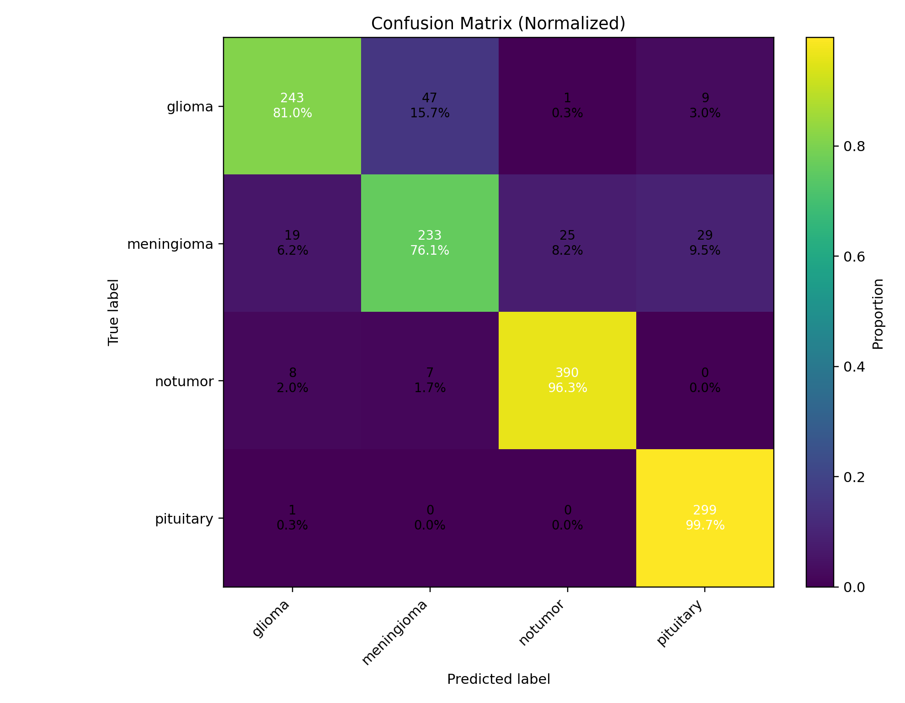

# 🧠 MediScan — MRI Brain Tumor Classifier (Glioma / Meningioma / Pituitary / No Tumor)

Deep-learning pipeline for classifying **brain MRI** scans into:
**glioma**, **meningioma**, **pituitary**, **notumor**.  
Includes training, metrics/plots, and a robust predictor that works both in **Jupyter** and **Command Prompt**.

---

## 📂 Dataset Layout

Your folders (as provided):

C:\Users\sagni\Downloads\MRI Scan
└─ archive
├─ Training
│ ├─ glioma
│ ├─ meningioma
│ ├─ pituitary
│ └─ notumor
└─ Testing
├─ glioma
├─ meningioma
├─ pituitary
└─ notumor\

yaml
Copy code

> The script infers class order from **Training** subfolders. Keep names consistent across Training/Testing.

---

## ⚙️ Requirements

- Python 3.9–3.11
- Recommended GPU with CUDA/cuDNN (optional)

Install once:

```bash
pip install "tensorflow==2.15.0" tensorflow-io-gcs-filesystem==0.34.0
pip install numpy pandas scikit-learn pillow pyyaml tqdm matplotlib
(Optional for DICOM input in the predictor)

bash
Copy code
pip install pydicom
🚀 Train
Script: train_mriscan.py
Trains EfficientNetB0 with light augmentations, makes a small validation split from Training, evaluates on Testing, and saves artifacts:

Artifacts written to:

vbnet
Copy code
C:\Users\sagni\Downloads\MRI Scan\
  ├─ model.h5
  ├─ class_indices.pkl
  ├─ run_config.yaml
  ├─ metrics.json
  ├─ accuracy_loss.png                 (optional helper)
  ├─ confusion_matrix.png              (optional helper)
  ├─ classification_report.csv         (optional helper)
  └─ confusion_matrix.csv              (optional helper)
Run:

bash
Copy code
python train_mriscan.py
📈 Show Accuracy & Heatmap
Script: show_mriscan_results.py

Reads metrics.json and shows + saves Accuracy/Loss plot

Reads confusion_matrix.csv and shows + saves heatmap

If confusion_matrix.csv is missing, it recomputes it from model.h5 + Testing folder

Outputs:

Copy code
accuracy_loss_view.png
confusion_matrix_view.png
Run:

bash
Copy code
python show_mriscan_results.py
🔮 Predict (Single Image or Folder)
Script: predict_mriscan.py (Jupyter & CMD safe)

Features:

Accepts a single image or a folder (recursively).

Works in Jupyter where -f kernel.json is auto-injected (the script ignores it).

Saves:

predictions.csv

predictions.json

summary.json (counts, and a class-count bar chart)

annotated_predictions\*_pred.png (banner with predicted label + confidence)

Defaults to your Testing folder if no input is passed.

Examples:

bash
Copy code
# Default (Testing folder)
python predict_mriscan.py

# Explicit folder
python predict_mriscan.py --input "C:\Users\sagni\Downloads\MRI Scan\archive\Testing\glioma"

# Single file
python predict_mriscan.py --input "C:\Users\sagni\Downloads\MRI Scan\archive\Testing\meningioma\img_001.jpg"
Outputs written to:

pgsql
Copy code
C:\Users\sagni\Downloads\MRI Scan\
  ├─ predictions.csv
  ├─ predictions.json
  ├─ summary.json
  ├─ class_counts.png
  └─ annotated_predictions\*_pred.png
🧪 Labels & Class Order
The class mapping used at train time is saved in class_indices.pkl.
The predictor loads this file to ensure predictions line up with the same class order.

If you change folders (add/remove classes), retrain first, otherwise predictions will be misaligned.

🖼️ Image Formats
JPEG/PNG/BMP/TIFF/WEBP supported out of the box.

DICOM (.dcm) supported in the predictor if you install pydicom.

DICOMs are windowed to 8-bit and converted to RGB for inference.

🛠️ Config Highlights (defaults)
Image size: 256×256

Backbone: EfficientNetB0 (frozen for initial training)

Optimizer: Adam, LR 1e-3

Batch size: 16

Validation split from Training: 0.1

Light augmentations: small rotation/shift/zoom/brightness

For better accuracy, fine-tune the backbone: unfreeze last N layers and reduce LR (e.g., 1e-4) after initial convergence.

🧯 Troubleshooting
FileNotFoundError: Paths must use raw strings on Windows. Example:
r"C:\Users\sagni\Downloads\MRI Scan\archive\Testing"

“No images found … kernel.json” when running from Jupyter:
This happens if a script reads the -f kernel arg as a path.
Use the bundled predict_mriscan.py which ignores -f and also supports --input.

Poor accuracy:

Train for more epochs

Use larger image size (e.g., 320×320) if VRAM allows

Fine-tune backbone / lower LR

Balance classes / clean mislabeled samples

🗂️ Files in this Project
train_mriscan.py — Train + save artifacts & helper plots/CSVs

show_mriscan_results.py — Show & save accuracy/loss + heatmap (recomputes CM if missing)

predict_mriscan.py — Predict on image/folder (Jupyter/CMD safe), save CSV/JSON + annotated previews

🔭 Roadmap (Optional)
Add Grad-CAM overlays for explainability (tf-keras-vis or manual conv-layer Grad-CAM).

Export to TFLite/ONNX for faster inference or edge deployment.

Streamlit dashboard: upload → predict → heatmap → PDF report.
Author
SAGNIK PATRA
